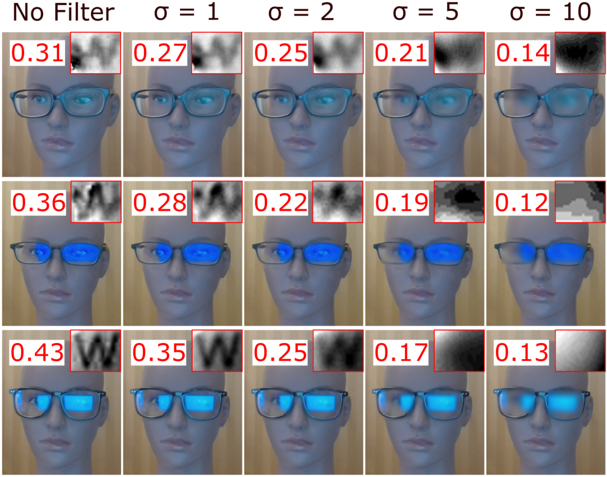

# Webcam Eyeglass Blur Filter

## This Python program is used in video conferencing to automatically locate and blur your eyeglass areas in video streams in order to prevent inforamtion leakage from eyeglass optical reflections based webcam peeking.    
  

   

 

# Introduction
The figure demonstrates the application of a real-time defense against webcam peeking from our prototype developed with Dlib, OpenCV, and pyvirtualcam Python packages. It uses Dlib’s frontal face detector to initially detect the user’s face before predicting the location of 68 facial landmarks. Then, the program uses OpenCV to narrow the region of interest from the user’s entire face to just the eyeglasses region. OpenCV extracts this new region and applies a blur to mitigate the attacker’s ability to interpret any reflections. Pyvirtualcam allows us to feed this new video stream into different virtual cameras of our operating system, essentially treating our program as another ordinary webcam. After running the program, the user can select the virtual camera as their video input instead of the original webcam to directly feed the defense algorithm into their video conference platform. The program only has an approximately 0.035 second delay per frame, so there is no noticeable drop in framerate. Future development can further explore stronger reflection removal algorithms while maintaining an efficient runtime. 

# Installation & Usage

The program builds upon the virtual webcam funcitonality provided by [**pyvirtualcam**](https://github.com/letmaik/pyvirtualcam). pyvirtualcam supports virtual webcams in Windows, Linux, and MacOS. Please refer to pyvirtualcam's home page for the setup under different oprating systems. 

The current blurring funcitonality employs Guassian filters from cv2. When using the program, simply specify the sigma of the filter to adjust the filter strength, as shown in the figure above. 

